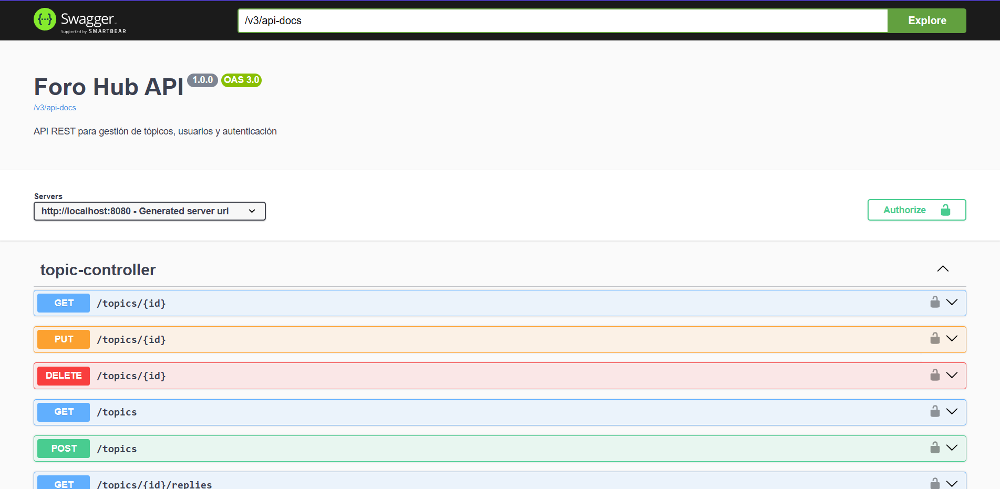

# Foro-Hub API

This project is a REST API for a forum application, It allows users to create, read, update and delete topics and replies, with a security layer implemented using JWT (JSON Web Tokens).

## ✨ Features

- **Authentication:** Secure endpoints using JWT-based authentication.
- **Users:** User registration and authentication.
- **Topics & Replies:** Full CRUD (Create, Read, Update, Delete) operations for forum topics and replies.
- **Pagination:** Paginated lists for topics to ensure efficient data retrieval.
-  **Database Migrations:** Uses Flyway for clear and version-controlled database schema management.
- **Docker Support:** Includes a `docker-compose.yml` file to easily set up the PostgreSQL database.
- **API Documentation:** Interactive API documentation with Swagger (OpenAPI).

## 🛠️ Technologies Used

- **Backend:** Java 17, Spring Boot 3
- **Database:** PostgreSQL
- **ORM:** Spring Data JPA (Hibernate)
- **Security:** Spring Security, JSON Web Tokens (JWT)
- **Database Migration:** Flyway
- **Build Tool:** Maven
- **API Documentation:** SpringDoc (Swagger/OpenAPI 3)
- **Containerization:** Docker

## 🚀 Getting Started

Follow these instructions to get a local copy up and running for development and testing.

### Prerequisites

- [Java JDK 17](https://www.oracle.com/java/technologies/javase/jdk17-archive-downloads.html) or later
- [Apache Maven](https://maven.apache.org/download.cgi)
- [Docker](https://www.docker.com/get-started) and [Docker Compose](https://docs.docker.com/compose/install/)

### Installation & Setup

1. **Clone the repository:**
   ```sh
   git clone https://github.com/your-username/Foro-Hub---Challenge.git
   cd Foro-Hub---Challenge
   ```

2. **Set up the database with Docker:**
   In the root directory, run the following command to start the PostgreSQL database container. 
   ```sh
   docker-compose up -d
   ```
   This will use the configuration from the `docker-compose.yml` file.
   
    > **Note**: Remember create your `.env` file using `.env.example`

3. **Configure the application:**
   The application is configured to connect to the Docker database by default. You can review the settings in `src/main/resources/application.properties`.

4. **Run the application:**
   Use the Maven wrapper to start the Spring Boot application.
   ```sh
   ./mvnw spring-boot:run
   ```
   The API will be available at `http://localhost:8080`.

## 📖 API Documentation (Swagger)

This project uses **SpringDoc** to generate live API documentation, which allows for easy exploration and testing of the endpoints.

Once the application is running, you can access the Swagger UI at:
👉 **[http://localhost:8080/swagger-ui/index.html](http://localhost:8080/swagger-ui/index.html)**



### Authorizing in Swagger UI

Since the endpoints are secured, you need to provide a JWT to access them.

1.  First, use the `/auth/login` endpoint to authenticate with a valid user. The response will contain a JWT token.
2.  Click the **"Authorize"** button at the top of the Swagger UI page.
3.  In the dialog, enter `Bearer <your_jwt_token>` and click "Authorize".
4.  You can now test all the protected endpoints!


## 📮 Postman Collection

A Postman collection is included in the path `collection/foro.postman_collection.json`) to simplify API testing.

### How to Use

1.  **Import:** Import the `foro.postman_collection.json` file into Postman.
2.  **Authenticate:**
    - Open the `auth > Login` request.
    - In the body, provide the credentials for a registered user or use `register` endpoint.
    - Send the request. The JWT will be returned in the response.
3.  **Set Token:** The collection is pre-configured to use a `{{token}}` variable. You can manually copy the token from the login response and paste it into this variable to automatically authorize all other requests in the collection.
